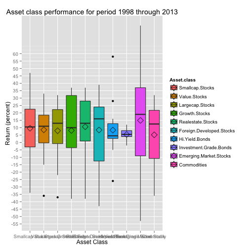
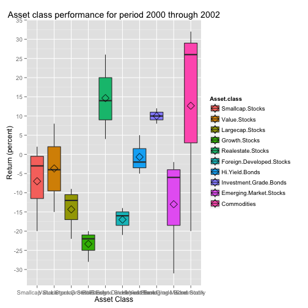
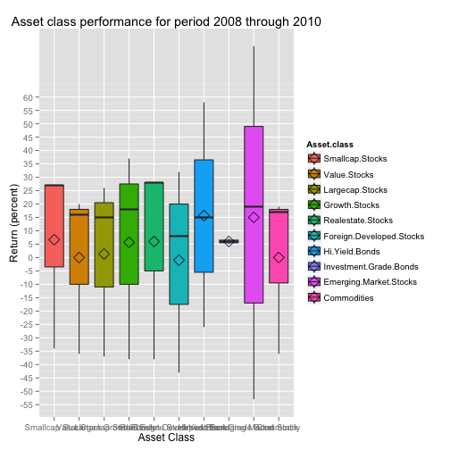

## Objective

- Visually compare performance of investment asset classes over time  
- Compare performance over maximum available time range (1998 thru 2013)  
- Compare performance during dotcom bust  
- Compare performance during great recession  
- Data is intended as input for constructing diverified portfolio for minimizing volatility and maximizing return  

--- .class #id 

## Performance 1998-2013

 

--- .class #id 

## Performance 2000-2002

 

--- .class #id 

## Performance 2008-2010

 

---

